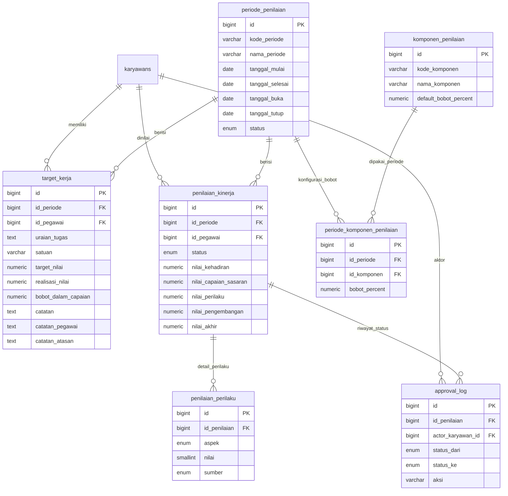

# Schema Penilaian Kinerja

Dokumentasi rancangan database untuk modul penilaian kinerja pegawai.

Konteks sistem:

- Data karyawan sudah tersedia pada tabel `karyawans`.
- Absensi sudah tersedia dan dapat digunakan untuk menghitung komponen `Kehadiran`.
- Struktur approval organisasi: Staf -> Kepala Divisi -> Manager.

## ERD



## SQL Migration PostgreSQL

```sql
-- =========================================================
-- Modul Penilaian Kinerja
-- PostgreSQL Migration
-- Asumsi:
-- - Tabel karyawans(id) sudah ada
-- - Jika tabel users ada, bisa ditambahkan FK actor_user_id secara terpisah
-- =========================================================

DO $$
BEGIN
  CREATE TYPE periode_penilaian_status AS ENUM ('draft', 'aktif', 'tutup');
EXCEPTION WHEN duplicate_object THEN NULL;
END $$;

DO $$
BEGIN
  CREATE TYPE target_kerja_status AS ENUM ('draft', 'diajukan', 'disetujui', 'ditolak');
EXCEPTION WHEN duplicate_object THEN NULL;
END $$;

DO $$
BEGIN
  CREATE TYPE penilaian_kinerja_status AS ENUM ('draft', 'diajukan', 'diverifikasi', 'disetujui', 'final');
EXCEPTION WHEN duplicate_object THEN NULL;
END $$;

DO $$
BEGIN
  CREATE TYPE perilaku_aspek AS ENUM (
    'integritas',
    'kerjasama',
    'inisiatif',
    'orientasi_layanan',
    'kedisiplinan'
  );
EXCEPTION WHEN duplicate_object THEN NULL;
END $$;

DO $$
BEGIN
  CREATE TYPE perilaku_sumber AS ENUM ('mandiri', 'atasan');
EXCEPTION WHEN duplicate_object THEN NULL;
END $$;

CREATE TABLE IF NOT EXISTS periode_penilaian (
  id BIGSERIAL PRIMARY KEY,
  kode_periode VARCHAR(50) NOT NULL UNIQUE,
  nama_periode VARCHAR(150) NOT NULL,
  tanggal_mulai DATE NOT NULL,
  tanggal_selesai DATE NOT NULL,
  tanggal_buka DATE NOT NULL,
  tanggal_tutup DATE NOT NULL,
  status periode_penilaian_status NOT NULL DEFAULT 'draft',
  keterangan TEXT,
  created_at TIMESTAMP NOT NULL DEFAULT CURRENT_TIMESTAMP,
  updated_at TIMESTAMP NOT NULL DEFAULT CURRENT_TIMESTAMP,

  CONSTRAINT chk_periode_tanggal
    CHECK (tanggal_selesai >= tanggal_mulai),

  CONSTRAINT chk_periode_buka_tutup
    CHECK (tanggal_tutup >= tanggal_buka)
);

CREATE TABLE IF NOT EXISTS komponen_penilaian (
  id BIGSERIAL PRIMARY KEY,
  kode_komponen VARCHAR(50) NOT NULL UNIQUE,
  nama_komponen VARCHAR(150) NOT NULL,
  deskripsi TEXT,
  default_bobot_percent NUMERIC(5,2) NOT NULL DEFAULT 0,
  urutan INTEGER NOT NULL DEFAULT 0,
  aktif BOOLEAN NOT NULL DEFAULT TRUE,
  created_at TIMESTAMP NOT NULL DEFAULT CURRENT_TIMESTAMP,
  updated_at TIMESTAMP NOT NULL DEFAULT CURRENT_TIMESTAMP,

  CONSTRAINT chk_komponen_default_bobot
    CHECK (default_bobot_percent >= 0 AND default_bobot_percent <= 100)
);

CREATE TABLE IF NOT EXISTS periode_komponen_penilaian (
  id BIGSERIAL PRIMARY KEY,
  id_periode BIGINT NOT NULL REFERENCES periode_penilaian(id) ON DELETE CASCADE,
  id_komponen BIGINT NOT NULL REFERENCES komponen_penilaian(id) ON DELETE RESTRICT,
  bobot_percent NUMERIC(5,2) NOT NULL,
  aktif BOOLEAN NOT NULL DEFAULT TRUE,
  created_at TIMESTAMP NOT NULL DEFAULT CURRENT_TIMESTAMP,
  updated_at TIMESTAMP NOT NULL DEFAULT CURRENT_TIMESTAMP,

  CONSTRAINT uq_periode_komponen UNIQUE (id_periode, id_komponen),

  CONSTRAINT chk_periode_komponen_bobot
    CHECK (bobot_percent >= 0 AND bobot_percent <= 100)
);

CREATE TABLE IF NOT EXISTS target_kerja (
  id BIGSERIAL PRIMARY KEY,
  id_periode BIGINT NOT NULL REFERENCES periode_penilaian(id) ON DELETE CASCADE,
  id_pegawai BIGINT NOT NULL REFERENCES karyawans(id) ON DELETE CASCADE,
  uraian_tugas TEXT NOT NULL,
  satuan VARCHAR(50) NOT NULL,
  target_nilai NUMERIC(14,2) NOT NULL DEFAULT 0,
  realisasi_nilai NUMERIC(14,2),
  bobot_dalam_capaian NUMERIC(5,2) NOT NULL DEFAULT 0,
  status target_kerja_status NOT NULL DEFAULT 'draft',
  disetujui_oleh BIGINT REFERENCES karyawans(id) ON DELETE SET NULL,
  disetujui_pada TIMESTAMP,
  catatan TEXT,
  catatan_pegawai TEXT,
  catatan_atasan TEXT,
  created_at TIMESTAMP NOT NULL DEFAULT CURRENT_TIMESTAMP,
  updated_at TIMESTAMP NOT NULL DEFAULT CURRENT_TIMESTAMP,

  CONSTRAINT chk_target_nilai
    CHECK (target_nilai >= 0),

  CONSTRAINT chk_realisasi_nilai
    CHECK (realisasi_nilai IS NULL OR realisasi_nilai >= 0),

  CONSTRAINT chk_target_bobot
    CHECK (bobot_dalam_capaian >= 0 AND bobot_dalam_capaian <= 100)
);

CREATE TABLE IF NOT EXISTS penilaian_kinerja (
  id BIGSERIAL PRIMARY KEY,
  id_periode BIGINT NOT NULL REFERENCES periode_penilaian(id) ON DELETE CASCADE,
  id_pegawai BIGINT NOT NULL REFERENCES karyawans(id) ON DELETE CASCADE,
  id_penilai_atasan BIGINT REFERENCES karyawans(id) ON DELETE SET NULL,
  id_verifikator BIGINT REFERENCES karyawans(id) ON DELETE SET NULL,
  id_approver_final BIGINT REFERENCES karyawans(id) ON DELETE SET NULL,

  status penilaian_kinerja_status NOT NULL DEFAULT 'draft',

  nilai_kehadiran NUMERIC(5,2),
  nilai_capaian_sasaran NUMERIC(5,2),
  nilai_perilaku NUMERIC(5,2),
  nilai_pengembangan NUMERIC(5,2),
  nilai_akhir NUMERIC(5,2),

  tanggal_diajukan TIMESTAMP,
  tanggal_diverifikasi TIMESTAMP,
  tanggal_disetujui TIMESTAMP,
  tanggal_final TIMESTAMP,

  catatan_pegawai TEXT,
  catatan_atasan TEXT,
  catatan_verifikator TEXT,
  created_at TIMESTAMP NOT NULL DEFAULT CURRENT_TIMESTAMP,
  updated_at TIMESTAMP NOT NULL DEFAULT CURRENT_TIMESTAMP,

  CONSTRAINT uq_penilaian_periode_pegawai UNIQUE (id_periode, id_pegawai),

  CONSTRAINT chk_nilai_kehadiran
    CHECK (nilai_kehadiran IS NULL OR (nilai_kehadiran >= 0 AND nilai_kehadiran <= 100)),

  CONSTRAINT chk_nilai_capaian
    CHECK (nilai_capaian_sasaran IS NULL OR (nilai_capaian_sasaran >= 0 AND nilai_capaian_sasaran <= 120)),

  CONSTRAINT chk_nilai_perilaku
    CHECK (nilai_perilaku IS NULL OR (nilai_perilaku >= 0 AND nilai_perilaku <= 100)),

  CONSTRAINT chk_nilai_pengembangan
    CHECK (nilai_pengembangan IS NULL OR (nilai_pengembangan >= 0 AND nilai_pengembangan <= 100)),

  CONSTRAINT chk_nilai_akhir
    CHECK (nilai_akhir IS NULL OR (nilai_akhir >= 0 AND nilai_akhir <= 100))
);

CREATE TABLE IF NOT EXISTS penilaian_perilaku (
  id BIGSERIAL PRIMARY KEY,
  id_penilaian BIGINT NOT NULL REFERENCES penilaian_kinerja(id) ON DELETE CASCADE,
  aspek perilaku_aspek NOT NULL,
  nilai SMALLINT NOT NULL,
  sumber perilaku_sumber NOT NULL,
  id_penilai BIGINT REFERENCES karyawans(id) ON DELETE SET NULL,
  catatan TEXT,
  created_at TIMESTAMP NOT NULL DEFAULT CURRENT_TIMESTAMP,
  updated_at TIMESTAMP NOT NULL DEFAULT CURRENT_TIMESTAMP,

  CONSTRAINT uq_perilaku_penilaian_aspek_sumber
    UNIQUE (id_penilaian, aspek, sumber),

  CONSTRAINT chk_perilaku_nilai
    CHECK (nilai >= 1 AND nilai <= 5)
);

CREATE TABLE IF NOT EXISTS approval_log (
  id BIGSERIAL PRIMARY KEY,
  id_penilaian BIGINT NOT NULL REFERENCES penilaian_kinerja(id) ON DELETE CASCADE,
  actor_karyawan_id BIGINT REFERENCES karyawans(id) ON DELETE SET NULL,
  aksi VARCHAR(100) NOT NULL,
  status_dari penilaian_kinerja_status,
  status_ke penilaian_kinerja_status,
  catatan TEXT,
  created_at TIMESTAMP NOT NULL DEFAULT CURRENT_TIMESTAMP
);

INSERT INTO komponen_penilaian
  (kode_komponen, nama_komponen, default_bobot_percent, urutan, aktif)
VALUES
  ('KEHADIRAN', 'Kehadiran', 20.00, 1, TRUE),
  ('CAPAIAN_SASARAN', 'Capaian Sasaran Kerja', 40.00, 2, TRUE),
  ('PERILAKU_KERJA', 'Perilaku Kerja', 30.00, 3, TRUE),
  ('PENGEMBANGAN_KOMPETENSI', 'Pengembangan Kompetensi', 10.00, 4, TRUE)
ON CONFLICT (kode_komponen) DO UPDATE SET
  nama_komponen = EXCLUDED.nama_komponen,
  default_bobot_percent = EXCLUDED.default_bobot_percent,
  urutan = EXCLUDED.urutan,
  aktif = EXCLUDED.aktif,
  updated_at = CURRENT_TIMESTAMP;

CREATE INDEX IF NOT EXISTS idx_periode_penilaian_status
  ON periode_penilaian(status);

CREATE INDEX IF NOT EXISTS idx_periode_penilaian_tanggal
  ON periode_penilaian(tanggal_mulai, tanggal_selesai);

CREATE INDEX IF NOT EXISTS idx_periode_komponen_periode
  ON periode_komponen_penilaian(id_periode);

CREATE INDEX IF NOT EXISTS idx_target_kerja_periode_pegawai
  ON target_kerja(id_periode, id_pegawai);

CREATE INDEX IF NOT EXISTS idx_target_kerja_status
  ON target_kerja(status);

CREATE INDEX IF NOT EXISTS idx_penilaian_kinerja_periode_status
  ON penilaian_kinerja(id_periode, status);

CREATE INDEX IF NOT EXISTS idx_penilaian_kinerja_pegawai
  ON penilaian_kinerja(id_pegawai);

CREATE INDEX IF NOT EXISTS idx_penilaian_kinerja_penilai
  ON penilaian_kinerja(id_penilai_atasan);

CREATE INDEX IF NOT EXISTS idx_penilaian_perilaku_penilaian
  ON penilaian_perilaku(id_penilaian);

CREATE INDEX IF NOT EXISTS idx_penilaian_perilaku_sumber
  ON penilaian_perilaku(sumber);

CREATE INDEX IF NOT EXISTS idx_approval_log_penilaian_created
  ON approval_log(id_penilaian, created_at DESC);

CREATE INDEX IF NOT EXISTS idx_approval_log_actor_created
  ON approval_log(actor_karyawan_id, created_at DESC);
```

## Relasi Antar Tabel

- `periode_penilaian` adalah induk periode evaluasi, misalnya `Semester I 2026`.
- `komponen_penilaian` adalah master komponen global.
- `periode_komponen_penilaian` menyimpan bobot per periode, sehingga bobot bisa berbeda antar periode.
- `target_kerja` berisi sasaran kerja pegawai dalam periode tertentu.
- `target_kerja.id_pegawai` mengarah ke `karyawans.id`.
- `penilaian_kinerja` adalah header penilaian final per pegawai per periode.
- `penilaian_kinerja` memiliki unique constraint `id_periode + id_pegawai`, jadi 1 pegawai hanya punya 1 header penilaian per periode.
- `penilaian_perilaku` menyimpan detail 5 aspek perilaku kerja per penilaian.
- `penilaian_perilaku.sumber` membedakan penilaian mandiri dan atasan.
- `approval_log` mencatat semua perubahan status penilaian dari draft sampai final.
- Struktur Staf -> Kepala Divisi -> Manager diterapkan di layer aplikasi melalui `id_penilai_atasan`, `id_verifikator`, dan `id_approver_final`.

## Index Yang Disarankan

Index paling penting:

- `penilaian_kinerja(id_periode, id_pegawai)` untuk lookup penilaian pegawai per periode.
- `penilaian_kinerja(id_periode, status)` untuk dashboard progress penilaian.
- `target_kerja(id_periode, id_pegawai)` untuk mengambil target kerja pegawai.
- `approval_log(id_penilaian, created_at DESC)` untuk timeline approval.
- `periode_komponen_penilaian(id_periode)` untuk mengambil konfigurasi bobot periode.
- `penilaian_perilaku(id_penilaian)` untuk mengambil detail perilaku dari header penilaian.
